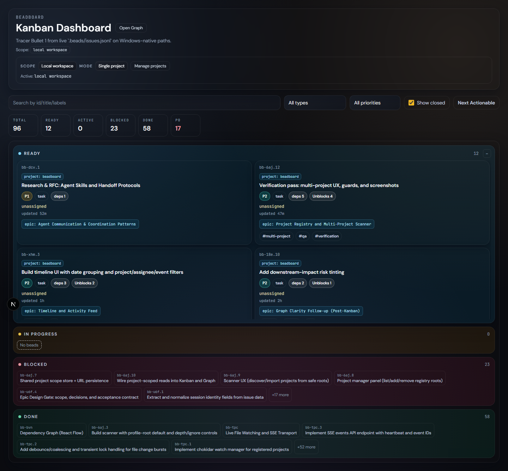
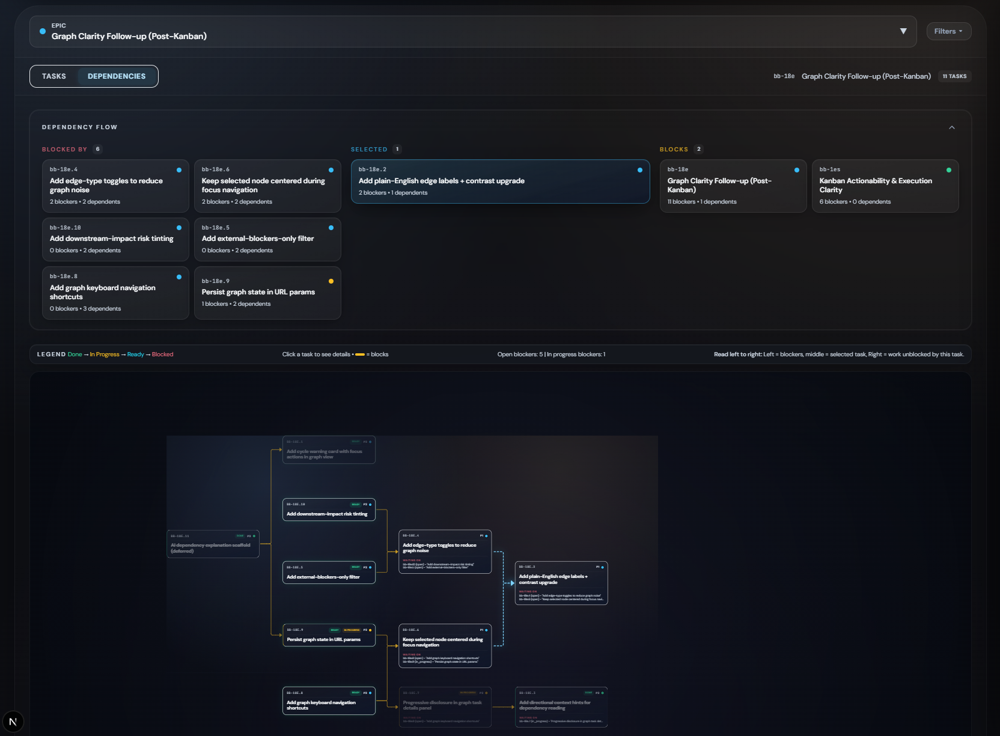

# BeadBoard

**The Windows-native Control Center for [Beads](https://github.com/steveyegge/beads).**

BeadBoard is a high-performance local dashboard for managing your software development tasks. Built on the Beads protocol, it provides a unified, visualization-rich interface over your distributed project landscape.

## 🚀 Why BeadBoard?
Most task managers are siloes. BeadBoard is a lens over your source code.
- **Source of Truth**: Reads directly from `.beads/issues.jsonl` in your repo. No database sync skew.
- **Windows Optimized**: Built from the ground up to handle Windows paths, drive letters, and filesystem performance.
- **Zero Latency**: Optimistic UI updates make interactions feel instant.

## ✨ Core Features

### 1. Multi-Project Registry & Scanner
Stop context switching between repos.
- **Project Registry**: Persist your favorite project roots for one-click access.
- **Auto-Discovery**: Built-in filesystem scanner finds Bead-enabled projects across your drives.
- **Aggregate Mode**: View tasks from *all* registered projects in a single unified board.

### 2. Interactive Kanban Dashboard (`/`)
Manage your flow state.

- **Live Updates**: Boards refresh automatically when the underlying JSONL files change (e.g., via CLI).
- **Progressive Disclosure**: Task details, metadata, and relations are tucked away until you need them.
- **Smart Filtering**: Filter by priority, assignee, status, or full-text search across thousands of beads.

### 3. Dependency Graph Explorer (`/graph`)
Understand the "Why" and "What's Next".

- **Epic-Centric Layout**: Automatically groups tasks by Epic for logical clustering.
- **True DAG Visualization**: Uses Dagre layout engine to enforce a strict Left-to-Right dependency flow.
  - *Left*: Incoming Blockers
  - *Center*: Focus Task
  - *Right*: Unlocks / Downstream
- **Focus Mode**: Minimizable dependency strip and deep-linking support for sharing exact views.
- **Smart Metadata**: See bead counts, priorities, and status health at a glance.

### 4. Agent Sessions Hub (`/sessions`)
Coordinate multi-agent workflows with social-dense visibility.
- **Epic-Grouped Task Feed**: Tasks organized by parent Epic with session state indicators (active, reviewing, needs_input, stale).
- **Cross-Agent Communication**: Built-in messaging with HANDOFF, BLOCKED, and INFO categories.
- **Agent Productivity Metrics**: Real-time stats showing active tasks, completions, and recent wins.
- **Derived Activity Engine**: O(N) snapshot diffing computes project history on-demand without separate event storage.
- **`bb agent` CLI Integration**: Visualizes data from agent registry, reservations, and mailboxes.

### 5. Chronological Timeline (`/timeline`)
Real-time activity feed for all project events.
- **Live Updates**: Server-Sent Events stream changes instantly.
- **Date Grouping**: Events organized by day (Today, Yesterday, etc.).
- **Polymorphic Cards**: Distinct visual styles for Status, Lifecycle, and Diff events.
- **History Buffer**: Recent events preserved across server restarts.

## 🛠️ Stack
- **Framework**: Next.js 15 (App Router)
- **UI Engine**: React 19 + Framer Motion
- **Styling**: Tailwind CSS + Custom Design System
- **Type Safety**: Strict TypeScript

## ⚡ Quick Start
1. **Install**: `npm install`
2. **Run**: `npm run dev`
3. **Explore**: Open `http://localhost:3000`

## 🤝 Contribution
- **Typecheck**: `npm run typecheck`
- **Test**: `npm run test`
