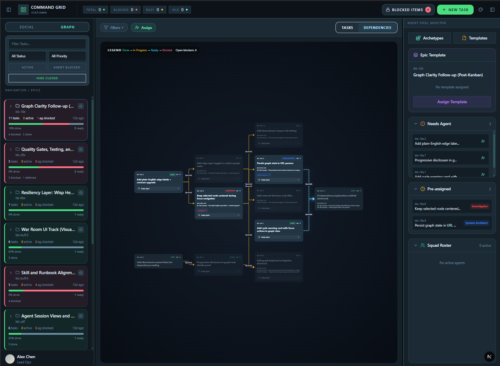

# BeadBoard
**Work in Progress, please contribute!** 
**BeadBoard is a multi-agent swarm coordination system built on [Beads](https://github.com/steveyegge/beads) inspired by [Gastown](https://github.com/steveyegge/gastown).** Thanks [Steve Yegge](https://github.com/steveyegge)!

BB is a visual operations layer for running agent teams against real dependency-constrained work.

---

## What This App Is
BeadBoard is not just a task board. It is an execution system for coordinating agents around shared Beads workflows:

- Agent-to-agent communication with explicit categories (`HANDOFF`, `BLOCKED`, `DECISION`, `INFO`)
- Conversation threads merged from activity events, agent messages, and local interactions
- Graph/topology context for deciding what should move next
- Global project scope switching across single and aggregate workspaces
- Swarm orchestration with archetypes/templates and assignment controls

---


---

## Core Features

### 1. Agent Communication System
- Structured message lifecycle: `send`, `inbox`, `read`, `ack`
- Message states: `unread`, `read`, `acked`
- Per-task conversation threads combining:
  - activity events
  - agent mail
  - local bd interactions
- Required acknowledgment semantics for high-signal categories (`HANDOFF`, `BLOCKED`)

### 2. Swarm Coordination Surface
- Agent Pool Monitor with:
  - Archetypes
  - Templates
  - Needs Agent queue
  - Pre-assigned queue
  - Squad roster
- Assignment workflow through the graph workspace and right panel
 

### 3. Graph + Dependency Topology
- DAG-oriented graph workspace for execution decisions
- Task/dependency tab modes for different planning lenses
- Blocker/unblock context surfaced directly in task cards
- Graph analysis support (cycle and blocked-chain context)


### 4. Global Project Scope + Scanner
- Project registry and scanner-backed discovery
- Single-project and aggregate modes
- Runtime scope switching without leaving the primary workspace

### 5. Realtime Operations Layer
- Live updates via watchers + SSE
- Activity stream integration with session/task context
- Mutation/writeback feedback integrated into the same operational surface

---

## Runtime Surface

### Active Route
- `/`

### View Modes
- `/?view=social`
- `/?view=graph`
- `/?view=activity`

### Compatibility Redirects
- `/graph` -> `/?view=graph`
- `/sessions` -> `/?view=social`
- `/timeline` -> `/?view=activity`
- `/mockup` -> `/`

### Archived Route Vault
Legacy route implementations are preserved in `reference/routes/**` and excluded from active runtime validation scope.

---

## Install

### Prerequisites
- Node.js `18.18+` (Node `20 LTS` recommended)
- npm

### Clone + Install
```bash
git clone https://github.com/zenchantlive/beadboard.git
cd beadboard
npm install
```

### Global CLI Install (Optional)
Primary install path:

```bash
npm i -g beadboard
```

Fallback wrappers from repo root:

POSIX (Linux/macOS):
```bash
bash ./install/install.sh
```

Windows (PowerShell):
```powershell
powershell -ExecutionPolicy Bypass -File .\install\install.ps1
```

Both wrappers install shims at:
- `~/.beadboard/bin/bb`
- `~/.beadboard/bin/beadboard`

Runtime home:
- `~/.beadboard/runtime/<version>`
- `~/.beadboard/runtime/current.json`

Launcher commands:
- `beadboard start`
- `beadboard open`
- `beadboard status`

---

## Quick Start

```bash
npm run dev
```

Open:

```text
http://localhost:3000
```

---

## Configuration
No external service is required for core local usage.

Runtime behavior is driven by:
- Local Beads project data
- Registered/scanned project roots
- URL query state (`view`, `task`, `swarm`, `agent`, `epic`, `graphTab`, panel state)

---

## Operating Flow

### 1. Coordinate through Graph + Pool
Open `/?view=graph`, inspect dependency topology, and drive assignment from the pool panel.

### 2. Communicate in Context
Open a task thread to read merged conversation context and process message acknowledgments.

### 3. Switch Scope as Work Expands
Use registry/scanner controls to move between local and aggregate project scope.

### 4. Track Live Signal
Use social/activity views to monitor execution movement and operational events.

---

## Roadmap Notes
- Cross-view assign controls in all major views.
- Social naming/UX evolution (including possible shift toward “swim” terminology).
- Continued expansion of global project config/scanner workflows.

---

## Scripts

```bash
npm run dev
npm run build
npm run start
npm run typecheck
npm run lint
npm run test
npm run video
npm run video:render
npm run video:thumbnail
```

---

## Architecture
- **Frontend**: Next.js App Router + React 19 + Tailwind + Framer Motion + Radix
- **Graph stack**: XYFlow + Dagre
- **Core domain**: Beads issue model, graph/kanban/session/social builders
- **Coordination layer**: agent mail + session communication + swarm orchestration state
- **Realtime**: watchers + SSE + snapshot differ + activity persistence
- **Validation/typing**: strict TypeScript + Zod contracts where applicable

---

## Project Structure

```text
src/
  app/
    page.tsx                # active runtime route
    api/                    # runtime API routes
  components/
    shared/ graph/ social/ activity/ sessions/ swarm/ kanban/
  hooks/
  lib/
reference/
  routes/                   # archived route implementations
```

---

## Contributing
1. Keep active runtime pages in `src/app` minimal.
2. Promote reusable logic into `src/lib`, `src/components`, `src/hooks`.
3. Archive non-runtime route experiments in `reference/routes`.
4. Run quality gates before merge:

```bash
npm run typecheck
npm run lint
npm run test
```

---

## License
MIT
