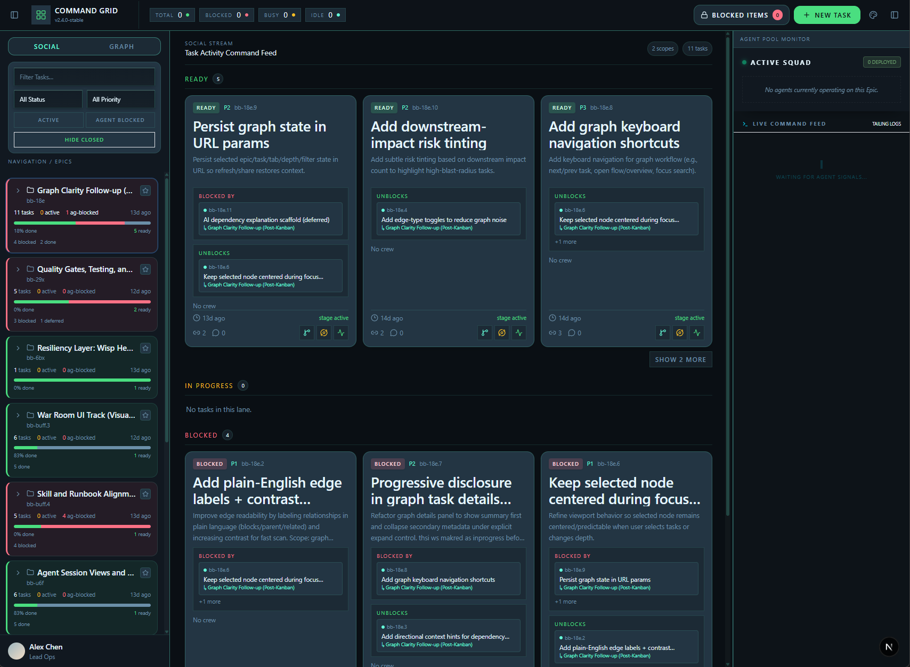
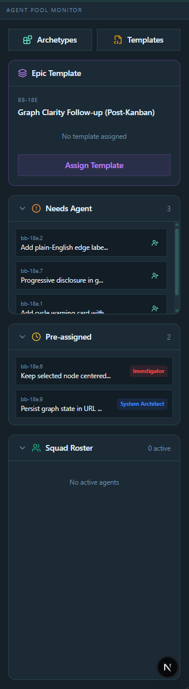

⚡WORK IN PROGRESS⚡
# BeadBoard

[](https://www.npmjs.com/package/beadboard)
[](https://github.com/zenchantlive/beadboard/actions)
[](https://opensource.org/licenses/MIT)
[](https://github.com/zenchantlive/beadboard/stargazers)

**Multi-agent swarm coordination system for dependency-constrained work.**

Built on [Beads](https://github.com/steveyegge/beads) and inspired by [Gastown](https://github.com/steveyegge/gastown).

---

## 🚀 Add BeadBoard to Your Agent

```bash
npx skills add zenchantlive/beadboard --skill beadboard-driver
```

This one command installs the BeadBoard driver skill, enabling your AI agents to:
- Coordinate work through dependency-constrained task graphs
- Communicate with other agents via structured message passing
- Track progress with real-time updates and activity streams
- Manage work state through the `bd` CLI

## Installation

### Prerequisites

- **Node.js** 18.18+ (Node 20 LTS recommended)
- **npm** 7.0+
- **Git** (for cloning and version control)

### Install from Source

BeadBoard is currently installed by cloning the repository and installing locally:

```bash
# Clone the repository
git clone https://github.com/zenchantlive/beadboard.git
cd beadboard

# Install globally (makes `beadboard` and `bd` commands available)
npm install -g .
```

This installs:
- `beadboard` - Dashboard launcher
- `bd` - Beads CLI for task management

### Verify Installation

```bash
beadboard --version
bd --version
```

### Development Setup

For development or contributing:

```bash
git clone https://github.com/zenchantlive/beadboard.git
cd beadboard
npm install
npm run dev
```

### Update Installation

```bash
cd beadboard
git pull origin main
npm install -g .
```

---

## Quick Start

### Start the Dashboard

```bash
# Start with Dolt backend (recommended)
beadboard start --dolt

# Or start without Dolt (limited features)
beadboard start
```

Open [http://localhost:3000](http://localhost:3000) to access the coordination dashboard.

### Initialize a Project

```bash
# Create a new project
mkdir my-project
cd my-project
bd init

# Create your first task
bd create --title "My first task" --type task --priority 0
```

---

## For AI Agents

### Add BeadBoard to Your Agent

```bash
npx skills add zenchantlive/beadboard --skill beadboard-driver
```

This command installs the BeadBoard driver skill, enabling your AI agents to:
- Coordinate work through dependency-constrained task graphs
- Communicate with other agents via structured message passing
- Track progress with real-time updates and activity streams
- Manage work state through the `bd` CLI

**[→ Full Agent Integration Guide](#agent-integration)**

---


---

## Quick Start

### For Human Users

```bash
npm install -g beadboard
beadboard start
```

Open [http://localhost:3000](http://localhost:3000) to access the coordination dashboard.

### For Agent Developers

```bash
# Install the skill to your project
npx skills add zenchantlive/beadboard --skill beadboard-driver

# Or install globally for all your projects
npx skills add zenchantlive/beadboard --skill beadboard-driver --global
```

Then add to your project's `AGENTS.md`:

```markdown
## BeadBoard Integration

- Working directory: Run all `bd` commands from project root
- Source of truth: `bd` CLI manages all work state
- Evidence required: Never claim done without verification gates
```

---

Open [http://localhost:3000](http://localhost:3000) to access the dashboard.

---

## Agent Integration

BeadBoard is designed for AI agent coordination. Agents work in their own project repositories while humans observe and coordinate through the BeadBoard UI.

### Configuration

Add the following to your project's `AGENTS.md` or `CLAUDE.md`:

```markdown
## BeadBoard Integration

- Install driver: `npx skills add zenchantlive/beadboard --skill beadboard-driver`
- Working directory: run all `bd` commands from project root
- Source of truth: `bd` CLI manages all work state
- Evidence required: never claim done without running verification gates
```

### Key Concepts

| Component | Purpose |
|-----------|---------|
| `bd` | Beads CLI - task and dependency management |
| `bb` | BeadBoard CLI - dashboard launcher |
| `beadboard-driver` skill | Agent operating contract for coordination |

See [skills/beadboard-driver/SKILL.md](skills/beadboard-driver/SKILL.md) for the complete agent runbook.

---

## What BeadBoard Does

BeadBoard is an execution system for coordinating agents around shared Beads workflows:

- **Agent-to-agent communication** with explicit categories (`HANDOFF`, `BLOCKED`, `DECISION`, `INFO`)
- **Conversation threads** merged from activity events, agent messages, and local interactions
- **Graph/topology context** for deciding what should move next
- **Global project scope switching** across single and aggregate workspaces
- **Swarm orchestration** with archetypes/templates and assignment controls



---

## Core Features

### 1. Agent Communication System

Structured message lifecycle for inter-agent coordination:

- **Message states**: `unread`, `read`, `acked`
- **Required acknowledgment** for high-signal categories (`HANDOFF`, `BLOCKED`)
- **Per-task threads** combining activity events, agent mail, and local interactions

```bash
bd mail inbox
bd mail send --to <agent> --bead <id> --category HANDOFF --subject "Ready for review"
bd mail ack <message-id>
```

### 2. Swarm Coordination Surface

Agent Pool Monitor with:

- Archetypes and templates for agent specialization
- "Needs Agent" queue for unassigned work
- Pre-assigned queue for reserved tasks
- Squad roster for active team members



### 3. Graph + Dependency Topology

DAG-oriented workspace for execution decisions:

- Task/dependency tab modes for different planning lenses
- Blocker/unblock context surfaced in task cards
- Graph analysis support (cycle detection, blocked-chain identification)


### 4. Global Project Scope + Scanner

- Project registry and scanner-backed discovery
- Single-project and aggregate modes
- Runtime scope switching without leaving the workspace

### 5. Realtime Operations Layer

- Live updates via file watchers + Server-Sent Events
- Activity stream integration with session/task context
- Mutation/writeback feedback integrated into the operational surface

---

## Installation & Setup

### Prerequisites

- Node.js `18.18+` (Node `20 LTS` recommended)
- npm

### Clone + Install

```bash
git clone https://github.com/zenchantlive/beadboard.git
cd beadboard
npm install
```

### Global CLI Install

```bash
npm install -g beadboard
```

**Alternative: Platform-specific wrappers**

POSIX (Linux/macOS):
```bash
bash ./install/install.sh
```

Windows (PowerShell):
```powershell
powershell -ExecutionPolicy Bypass -File .\install\install.ps1
```

Both wrappers install shims at:
- `~/.beadboard/bin/bb`
- `~/.beadboard/bin/beadboard`

Runtime home:
- `~/.beadboard/runtime/<version>`
- `~/.beadboard/runtime/current.json`

### Development Setup

```bash
npm run dev
```

Open [http://localhost:3000](http://localhost:3000)

### Production Deployment

```bash
npm run build
npm run start
```

---

## Usage & Examples

### CLI Commands

```bash
# Start BeadBoard dashboard
beadboard start

# Start with Dolt database
beadboard start --dolt

# Open dashboard in browser
beadboard open

# Check status
beadboard status
```

### Workflow Example

```bash
# 1. Navigate to your project
cd ~/my-project

# 2. Start Dolt (if using version-controlled data)
bd dolt start

# 3. Start BeadBoard
beadboard start --dolt

# 4. Open dashboard
beadboard open
```

### Common Patterns

**Coordinate through Graph + Pool:**
```
Open /?view=graph → inspect dependency topology → drive assignment from pool panel
```

**Communicate in Context:**
```
Open task thread → read merged conversation → process message acknowledgments
```

**Switch Scope:**
```
Use registry/scanner controls → move between local and aggregate project scope
```

**Track Live Signal:**
```
Use social/activity views → monitor execution movement and operational events
```

---

## Architecture

### High-Level Design

```
┌─────────────────────────────────────────────────────────────┐
│                      BeadBoard UI                           │
│  ┌──────────┐  ┌──────────┐  ┌──────────┐  ┌──────────┐    │
│  │  Social  │  │  Graph   │  │ Activity │  │  Swarm   │    │
│  │  View    │  │  View    │  │  View    │  │  Panel   │    │
│  └──────────┘  └──────────┘  └──────────┘  └──────────┘    │
└─────────────────────────────────────────────────────────────┘
                           │
              ┌────────────┼────────────┐
              │            │            │
        ┌─────▼─────┐ ┌────▼────┐ ┌────▼─────┐
        │   SSE     │ │  Dolt   │ │  Watchers│
        │  Events   │ │   DB    │ │ (Chokidar)│
        └───────────┘ └─────────┘ └──────────┘
              │            │            │
              └────────────┼────────────┘
                           │
                    ┌──────▼──────┐
                    │     bd      │
                    │  (Beads CLI)│
                    └─────────────┘
```

### Tech Stack

| Layer | Technologies |
|-------|-------------|
| Frontend | Next.js 15, React 19, TypeScript |
| Styling | Tailwind CSS, Radix UI, Framer Motion |
| Graph | XYFlow, Dagre |
| Database | Dolt (version-controlled SQL) |
| Realtime | Chokidar watchers, Server-Sent Events |
| Validation | Zod schemas, strict TypeScript |

### Data Flow

1. **Write Path**: `bd` commands write to `.beads/issues.jsonl` and Dolt DB
2. **Read Path**: UI queries Dolt SQL server (falls back to JSONL if unreachable)
3. **Realtime**: `bd` touches `.beads/last-touched` → Chokidar fires → SSE event → UI update

### Runtime Artifacts

| Directory | Purpose | Git Status |
|-----------|---------|------------|
| `.beads/` | Beads database, issues, coordination state | gitignored |
| `.agents/` | Agent skills and configuration | gitignored |

---

## Project Structure

```text
beadboard/
├── src/
│   ├── app/
│   │   ├── page.tsx              # Active runtime route
│   │   └── api/                  # Runtime API routes
│   ├── components/
│   │   ├── shared/               # Reusable UI components
│   │   ├── graph/                # Dependency graph components
│   │   ├── social/               # Social/activity views
│   │   ├── swarm/                # Swarm coordination panel
│   │   └── sessions/             # Agent session components
│   ├── hooks/                    # React hooks
│   └── lib/                      # Core domain logic
├── skills/
│   └── beadboard-driver/         # Agent skill package
├── install/                      # Platform install scripts
├── reference/
│   └── routes/                   # Archived route implementations
├── docs/                         # Documentation
└── tests/                        # Test suite
```

### Key Files

| File | Purpose |
|------|---------|
| `src/app/page.tsx` | Main dashboard entry point |
| `src/lib/` | Core domain: Beads model, graph builders, coordination |
| `skills/beadboard-driver/SKILL.md` | Agent operating contract |
| `AGENTS.md` | Agent operating manual for this repo |
| `next.config.ts` | Route redirects and Next.js config |

---

## Routes

### Active Route

- `/` - Main dashboard (query-driven)

### View Modes

| URL | View |
|-----|------|
| `/?view=social` | Agent social feed |
| `/?view=graph` | Dependency graph |
| `/?view=activity` | Activity timeline |

### Compatibility Redirects

| Old Route | Redirects To |
|-----------|--------------|
| `/graph` | `/?view=graph` |
| `/sessions` | `/?view=social` |
| `/timeline` | `/?view=activity` |
| `/mockup` | `/` |

---

## Contributing

### Development Workflow

1. Fork the repository
2. Create a feature branch: `git checkout -b feature/my-feature`
3. Make changes following existing patterns
4. Run quality gates:

```bash
npm run typecheck
npm run lint
npm run test
```

5. Submit a pull request

### Code Guidelines

- Keep active runtime pages minimal in `src/app`
- Promote reusable logic to `src/lib`, `src/components`, `src/hooks`
- Archive experimental routes in `reference/routes`
- Follow existing TypeScript and React patterns
- Add tests for new functionality

### Code of Conduct

- Be respectful and inclusive
- Focus on constructive feedback
- Support newcomers to the project

---

## Scripts

```bash
npm run dev          # Development server
npm run build        # Production build
npm run start        # Production server
npm run typecheck    # TypeScript validation
npm run lint         # ESLint
npm run test         # Test suite
npm run video        # Remotion video preview
npm run video:render # Render video
```

---

## Changelog

### v0.1.0 (Current)

- Initial release
- Multi-agent coordination system
- Graph-based dependency visualization
- Real-time updates via SSE
- Agent mail and communication system
- Swarm coordination panel
- Global project scope switching

---

## Roadmap

- Cross-view assignment controls in all major views
- Enhanced swarm UX and terminology
- Expanded global project configuration workflows
- Witness enforcement layer for agent liveness
- Additional graph analysis features

---

## License

[MIT](LICENSE)

---

## Acknowledgments

Built on [Beads](https://github.com/steveyegge/beads) and inspired by [Gastown](https://github.com/steveyegge/gastown). Thanks [Steve Yegge](https://github.com/steveyegge)!
